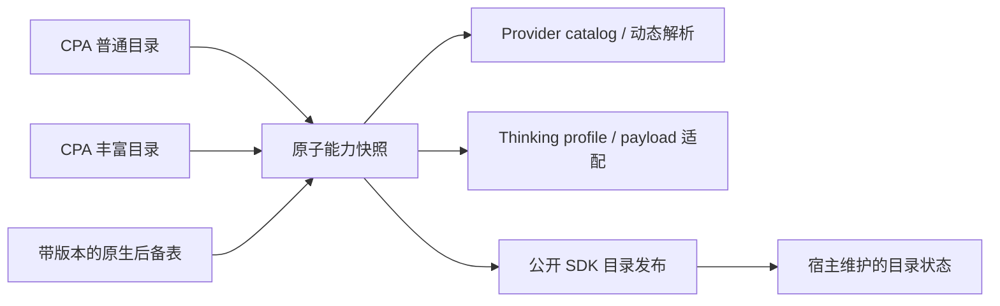

# 调研、架构与兼容边界

调研日期：2026-09-08。结论依据实际部署产物、对应版本/当前上游源码和隔离实验，不依赖“Codex 应该有某个接口”的假设。

## 核实的版本

| 对象 | 核实内容 |
| --- | --- |
| 本机 OpenClaw | `2026.7.1-2`，CLI build `0790d9f`；读取安装包内 SDK 类型、编译源码及官方文档 |
| 本机 CPA | Docker `eceasy/cli-proxy-api:v7.2.149`，二进制 commit `2a6b87a`，2026-09-03 构建 |
| CPA 当前源码及后备表 | [`d198db54d4c4886c99b21488d54fc576933019a3`](https://github.com/router-for-me/CLIProxyAPI/tree/d198db54d4c4886c99b21488d54fc576933019a3)，同时 fetch `v7.2.149` 比较 |
| OpenClaw 当前上游 | [`225845acbfe8bed7f155d3113affeeee2fd48fbc`](https://github.com/openclaw/openclaw/tree/225845acbfe8bed7f155d3113affeeee2fd48fbc)，`package.json` 为 `2026.9.2`；与本机 July SDK 已存在结构差异 |

本机 CPA endpoint 从现有 OpenClaw 配置只读取得，为 `http://127.0.0.1:18317/v1`。没有输出或复制真实凭据到仓库，没有修改 CPA 账号、路由、配额或部署配置。

## OpenClaw 架构

本机 `docs/plugins/sdk-provider-plugins.md` 与 `dist/types-*.d.ts` 确认：

1. 独立扩展通过 `definePluginEntry` / `registerProvider` 注册文本 provider。manifest 声明 provider 归属、认证环境变量及配置 schema。
2. `catalog.run` 仍是文本运行时模型配置来源；`registerModelCatalogProvider` 是新的统一控制面目录。两者在该版本并未完全统一。
3. `prepareDynamicModel` 用于异步预取，`resolveDynamicModel` 同步解析目录未包含的模型，`normalizeResolvedModel` 可应用最新元数据。`resolveThinkingProfile` 向 `/think` 提供离散选项、默认值和排序。
4. `wrapStreamFn`、`wrapSimpleCompletionStreamFn` 能复用标准流解析器，只修正最终 payload。无需自建 OpenAI SSE parser、工具调用 loop 或路由代理。
5. `models-config` 负责模型合并、凭据 marker、原子写入和插件归属的 `agents/<agent>/agent/plugins/<plugin>/catalog.json`。不应该直接覆盖用户 `models.json` 或把每次发现结果写回主配置。

复用的动态发现实现/工具：

- `provider-catalog-live-runtime`：官方受保护 HTTP fetch、认证 header、超时、4 MiB body 上限、分页和连接释放。选用 `fetchLiveProviderModelRows`，插件自己维护跨两个 CPA 端点的原子快照及 stale 策略；SDK 内置静态回退/单端点 TTL 不足以表示这个组合。
- Ollama provider：provider 级发现和本地 endpoint 处理的参考。
- LiteLLM：本机实现主要是静态模型 builder 和 auth/baseUrl 接入，并不是可直接复用的 CPA 能力发现器。
- `buildProviderReplayFamilyHooks({ family: "openai-compatible" })`：复用通用 OpenAI-compatible 历史清理，不把任意 CPA 模型当原生 Claude/Gemini 请求。

## CPA 实际暴露了什么

源码锚点：

- [`sdk/api/handlers/openai/openai_handlers.go`](https://github.com/router-for-me/CLIProxyAPI/blob/d198db54d4c4886c99b21488d54fc576933019a3/sdk/api/handlers/openai/openai_handlers.go)：`OpenAIModels`。
- [`internal/client/codex/models/models.go`](https://github.com/router-for-me/CLIProxyAPI/blob/d198db54d4c4886c99b21488d54fc576933019a3/internal/client/codex/models/models.go)：`BuildResponseForClient`、模板合成、`applyCodexClientModelMetadata`、thinking 投影。
- [`internal/registry/model_registry.go`](https://github.com/router-for-me/CLIProxyAPI/blob/d198db54d4c4886c99b21488d54fc576933019a3/internal/registry/model_registry.go)：`ModelInfo`、`ThinkingSupport`、动态可用性和输出投影。
- [`internal/thinking/convert.go`](https://github.com/router-for-me/CLIProxyAPI/blob/d198db54d4c4886c99b21488d54fc576933019a3/internal/thinking/convert.go)、[`validate.go`](https://github.com/router-for-me/CLIProxyAPI/blob/d198db54d4c4886c99b21488d54fc576933019a3/internal/thinking/validate.go)：跨协议预算转换、实际档位校验。

| 接口/来源 | 实际信息 | 插件用途 |
| --- | --- | --- |
| `/v1/models` | handler 特意裁剪为 `id/object/created/owned_by` | 可用性与所有权；元数据不能扩增此集合 |
| `/v1/models?client_version=` | `{models:[...]}`，有 `slug`、上下文、输出限额、模态、reasoning 档位等 | 实时能力主要来源；空 version 在 CPA 中保留现代扩展字段 |
| `/v1beta/models` | Gemini 风格 token limit、generation methods 等 | 不包含完整 thinking 结构，不作为通用精确信息源 |
| `/v0/management/model-definitions/:channel` | 原生定义 | 需要管理权限，不为普通模型客户端索要管理密钥 |
| CPA 原生 `models.json` 与内置 model definitions | 已知模型的 `ThinkingSupport`、token limits、模态、媒体模型 ID | 按精确 ID 使用的随包后备表；不用于模型可用性判断 |

没有把 Codex catalog 当作“原生能力事实全集”：

- 非模板模型会从 Codex 模板复制默认字段。原生 `thinking == nil` 时并不会清掉模板继承的 thinking 声明；实测 `kimi-k2` 和一些 Grok 模型因此被错误宣告多档 reasoning。
- 预算型 thinking 的 `levels` 可为空。当前源码写 `supported_reasoning_levels: []`，本机 `v7.2.149` 会删除这个字段；两者都丢失了预算范围，需要原生表辅助。
- 模板可能给图片/视频生成模型附上文本和 reasoning 字段。CPA 自己的 `visibility: hide` 与精确内置媒体 ID 用于排除它们。
- 同一模型在不同计划下可能有不同上下文。后备表只保留一致字段，不任意选择最大的计划。
- 本机 GPT Sol 的 live catalog 声明 `ultra`，原生表及请求验证器只允许到 `max`。真实请求返回 `400: level "ultra" not supported, valid levels: low, medium, high, xhigh, max`。这不是插件可以从普通 endpoint 完美消除的信息不一致；默认 UI 不宣告 ultra，诊断同时保留 live 和 native 信息。

## 同步方案与实际发现的限制

缓存按 endpoint + credential 的 SHA-256 隔离，最多 16 个条目；同一个目录的并发读取合并。两个请求都完成并验证后才替换快照。超时/失败使用有上限的 stale 数据，认证失效不沿用旧数据；失败重试有短退避。只存进程内缓存，没有插件自己的磁盘凭据文件。

### 本机 July 版本

实验顺序及结论：

1. 只注册 provider + unified live catalog：`openclaw cpa catalog` 成功，但 `models list --all --provider cliproxyapi` 返回 `No models found`。
2. 调用公开 `loadModelCatalog`，使用含最新模型定义的临时 config view：宿主自身写入插件目录 sidecar，CLI 能看到新增模型，并移除旧模型；`openclaw.json` 字节不变。
3. Gateway service 每次 revision 变化后执行同样发布：隔离 Gateway 的目录文件自动从 a/b 变为 b/c、上下文 64K 变 96K，空目录也能正确替换。
4. **运行中的旧 `models.list` RPC 仍返回 a/b。** `src/gateway/server-model-catalog.ts` 的 `lastSuccessfulCatalog` 只有配置/插件重载时才被 `markGatewayModelCatalogStaleForReload` 标记失效；该函数不在公开 SDK。
5. 对隔离 Gateway 做正常重启后，RPC 返回正确的 b/c。该边界作为回归测试保留，不能声称“加一个 TTL 就能热刷新所有 UI”。

因此 July 兼容方案自动刷新目录文件、公开 live catalog 与请求时的能力；旧 Gateway 选择器经用户正常重启/配置重载更新。没有导入带 hash 的私有模块、猴子补丁、覆写 `models.list` RPC，或用无意义配置写入制造重载。

### 当前上游 prepared catalog

新上游 [`src/agents/prepared-model-catalog.ts`](https://github.com/openclaw/openclaw/blob/225845acbfe8bed7f155d3113affeeee2fd48fbc/src/agents/prepared-model-catalog.ts) 与 [`src/gateway/server-model-catalog.ts`](https://github.com/openclaw/openclaw/blob/225845acbfe8bed7f155d3113affeeee2fd48fbc/src/gateway/server-model-catalog.ts) 已改用原子的已发布 runtime generation。

公开 [`plugin-sdk/agent-runtime.ts`](https://github.com/openclaw/openclaw/blob/225845acbfe8bed7f155d3113affeeee2fd48fbc/src/plugin-sdk/agent-runtime.ts) 导出 `loadPreparedModelCatalog`。插件探测到它时使用原配置和 `{readOnly:false, refreshFullCatalog:true}`，不再构造 July 兼容 view。它拥有 lifecycle 的显式 inventory refresh，架构上更合适。

这条分支依据源码和单元契约测试实现，**尚未在新版 Gateway 端到端验证**。不要据此声称新版所有配置/会话都已覆盖。维护时运行同样的隔离 CLI/Gateway suites，并检查 SDK 保留的兼容入口。

## 第三方复用调查

查询 GitHub `openclaw cliproxyapi`，并阅读这些项目的 README：

- [luyuehm/cliproxyapi-plus-openclaw-pack](https://github.com/luyuehm/cliproxyapi-plus-openclaw-pack)：安装 skill，管理/自愈服务，没有提供本任务所需的 provider metadata 实现。
- [ymeng98/openclaw-cliproxy-kit](https://github.com/ymeng98/openclaw-cliproxy-kit)：账号池、仪表盘、模型切换与配置脚本，包含早期参数兼容 shim；不是基于当前 provider/thinking SDK 的可直接移植插件。
- [aleksesipenko/openclaw-codex-kit](https://github.com/aleksesipenko/openclaw-codex-kit)：代理部署、Codex 账号导入/轮换、配置接线与启动器，职责比模型 provider 更宽。

未发现可直接复用的完整实现；这不是对所有开源项目不存在同类方案的证明。最终复用 OpenClaw 官方 SDK 和 CPA 数据，不引入上述项目的部署/账号管理体系。

## 维护原则

- API 和模型能力事实放在 provider 内；标准认证、请求 transport、工具事件、目录写锁和文件格式交给 OpenClaw。
- 只拉 CPA endpoint；随包表可由维护脚本从固定 commit 重建。不会运行网络返回的代码或模型指令。
- 真实目录不暴露的工具能力、价格、alias 底层身份不伪造。异常/缺失用诊断和保守值表达。
- 需要上游进一步完善的事实：普通用户可取的原生 metadata + provenance、与验证器一致的 reasoning 能力、稳定公开的目录变更通知/发布接口。新 prepared runtime 已解决部分生命周期问题，但不能修复 CPA 返回的元数据自身矛盾。
